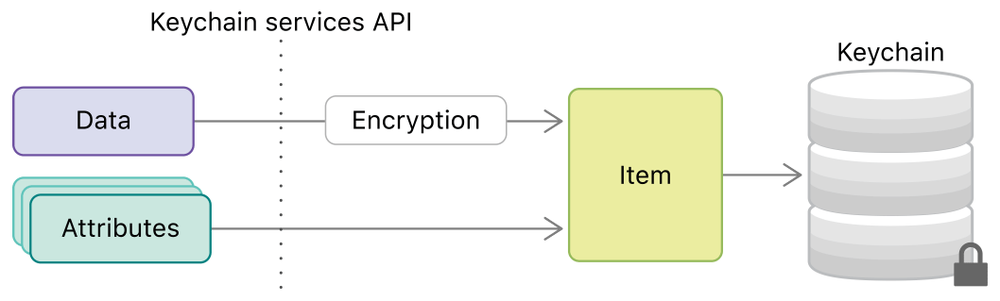
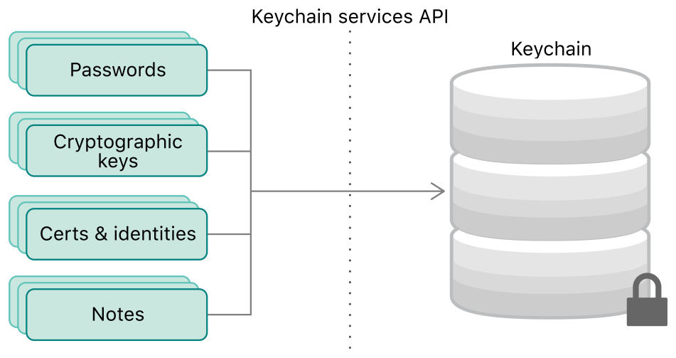

# Keychain in iOS

Chào mừng bạn đến với Fx Studio. Chủ đề bài viết lần này là Keychain trong iOS. Đó là một trong các cách để bạn lưu trữ dữ liệu quan trọng ứng dụng iOS. Keychain không phải là cái mới, thậm chí còn khá lâu đời. Nhưng lại hầu như ít được các dev sử dụng. Và bài viết lần này, giúp bạn tìm hiểu cơ bản về Keychain là gì và cách sử dụng cơ bản của nó.

Còn nếu không có vấn đề gì nữa, thì ...

> Bắt đầu thôi!

## Keychain là gì?

Khái niệm về Keychain rất đơn giản. Có thể tóm tắt qua câu sau:

> Keychain là nơi mà bạn sẽ lưu trữ các dữ liệu nhạy cảm.

### Keychain

Khi phát triển chúng ta nên lưu trữ những thông tin nhạy cảm này ở đâu mới đúng? Những dữ liệu lưu trong UserDefaults là những dữ liệu rời rạc, nhỏ, ... để lưu trữ chúng được bảo mật hơn thì Apple có cung cấp cho chúng ta Security services. Keychain services API sẽ giúp chúng ta giải quyết những vấn đề này bằng cách lưu trữ các data này ở trong một encrypted database được gọi là Keychain.

Lưu ý: Keychain sẽ liên kết với developer provisioning profile để sign vào ứng dụng của bạn. Nếu có sự thay đổi thì bạn không thể truy cập được chúng.

Cuối chùng, Keychain và Keychain API là một phần trong Security framework. Nên việc đầu tiền bạn cần phải thêm frameword đó vào file code mà bạn muốn sử dụng.

```swift
import Security
```

### Keychain Item

Keychain Item là phần tử được đăng ký trong Keychain. Chúng sẽ bao gồm 2 phần chính:

* Data : là phần dữ liệu mà bạn muốn lưu trữ
* Attributes : là các thuộc tính đính kèm vào phần dữ liệu đó của bạn

Vì tính chất bảo mật nên phần `data` sẽ được mã hóa trước khi trư trữ. Sau đó, bạn cần tạo ra môt đối tượng chứa cả `data` (đã được mã hóa) & `attributes`, để tiến hành lưu trữ chúng vào Keychain. Bạn có thể xem qua sơ đồ sau:



Vì chúng ta có thể xem Keychain là một cơ sở dữ liệu thu nhỏ. Nên bạn có thể làm được các tác vụ cơ bản (như: thêm, sửa, xóa ...) đối với các Keychain Item nhóe.

### Item Class

Item Class được xem như là một template để lưu trữ các dữ liệu mà bạn muốn. Keychain cung cấp các lớp khác nhau cho các kiểu thông tin lưu trữ như là: username/password, certificate, generic password ...



Đó chính là các dạng thông tin mà bạn muốn lưu trữ. Khi khai báo Item Class nào, thì bên cạnh đó bạn cần phải cung cấp thêm các thuộc tính cần thiết cho nó. Ví dụ với Internet Password thì nên có thêm thuộc tính server & account.

Mục đích chính là cách bạn sẽ `query` sau này, để có thể lấy được chính xác dữ liệu đã lưu. Đơn giản vì tất cả đều đã được mã hóa rồi. Chúng ta chỉ dựa vào các Item Class & Attributes để xác định chúng mà thôi.

## Adding Items

Như bao cơ sở dữ liệu khác mà bạn sử dụng, cho dù là iOS hay nền tảng khác đi nữa. Thì việc đầu tiên là thêm được các phần tử mới vào chúng.

### Adding

Function `SecItemAdd` sẽ dùng để thêm các phần tử vào Keychain. Đây là một trong các function khá lâu đời, bạn thể hơn ngạc nhiên về cách sử dụng của chúng. 

Tham số đầu tiên bạn sử dụng là một `dictionary`, ta gọi nó là một `query`. Nó sẽ chỉ định các dữ liệu và các kiểu dữ liệu lưu trữ trong Keychain. Bạn sẽ làm quen với kiểu dữ liệu là CFDictionary. Chúng ta sẽ tham khảo qua ví dụ với một `query` đầu tiên nhóe.

```swift
let query = [
        kSecValueData: "FxStudio".data(using: .utf8)!,
        kSecClass: kSecClassGenericPassword
    ] as CFDictionary
```
Trong đó:

* Item class được quy định bằng key `kSecClass`. Và kiểu được dùng là một generic password.
* Giá trị dữ liệu sẽ được mã hóa và được khai báo bằng key `kSecValueData`
* Sau cùng bạn cần ép kiểu về CFDictionary

Tham số thứ 2 là `UnsafeMutablePointer<CFTypeRef>?`, có thể chứa dữ liệu được tạo. Đây là một con trỏ chung chung không an toàn. Ta sẽ tìm hiểu nó sau, trong trường hợp thêm mới này chúng không quan trọng lắm.

Sau khi đã có 2 tham số rồi, chúng ta sẽ tiến hành thêm Item đầu tiên nhóe!

```swift
        let query = [
            kSecValueData: "FxStudio".data(using: .utf8)!,
            kSecClass: kSecClassGenericPassword
        ] as CFDictionary
        
        let status = SecItemAdd(query, nil)
        print("Status: \(status)")
```
Function `SecItemAdd` sẽ trả về một `OSStatus`, đây cũng là kiểu dữ liệu mà function trả về. Với giá trị là `0` hoặc `errSecSuccess` là thành công. Và khi bạn cố tình chạy đoạn code trên 2 lần trở lên thì sẽ gặp lỗi. Vì Item kia đã lưu vào Keychain rồi.

Với các Item class khác nhau thì bạn phải cần khai báo thêm các key khác nữa, nhất là các key mà Item Class đó bắt buộc bạn phải thêm vào. Tham khảo ví dụ sau nhóe!

```swift
        let query = [
            kSecValueData: "hello_keychain".data(using: .utf8)!,
            kSecAttrAccount: "chuotfx",
            kSecAttrServer: "fxstudio.dev",
            kSecClass: kSecClassInternetPassword
        ] as CFDictionary
        
        let status = SecItemAdd(query, nil)
        print("Status: \(status)")
```
Bạn cần chú ý các thuộc tính cần thêm vào sẽ có key với tiền tố là `kSecAttr`. Tại đó, bạn sẽ thêm các dữ liệu phù hợp vào nhóe. Build project và cảm nhận kết quả tiếp nhóe!

### Retrieving Newly Item

Tiếp theo, chúng ta sẽ tìm cách sử dụng các Item vừa được thêm vào bởi function `SecItemAdd`. Đây chính là tham số thứ 2 được đề cập ở trên, ta sẽ gọi nó là `result`. Ở ví dụ trên, ta sử truyền cho nó là `nil` và bây giờ bạn cân khai báo một biến số để sử dụng cho function. kiểu dữ liệu chính là `UnsafeMutablePointer<CFTypeRef>?`, bạn cũng thấy đó là một con trỏ. Tất nhiên, nó sẽ trỏ tới bấy kỳ đâu cũng được.

Chúng ta sẽ xem qua ví dụ code trước nhóe!

```swift
        let query = [
            kSecValueData: "hello_keychain".data(using: .utf8)!,
            kSecAttrAccount: "chuotfx1",
            kSecAttrServer: "fxstudio.dev",
            kSecClass: kSecClassInternetPassword,
            kSecReturnAttributes: true
        ] as CFDictionary
        
        var ref: AnyObject?
        
        let status = SecItemAdd(query, &ref)
        print("Status: \(status)")
        print("Result:")
        let result = ref as! NSDictionary
        result.forEach { key, value in
            print("\(key) : \(value)")
        }
```

Trong đó:

* `ref` với kiểu là CFTypeRef. Nó là cầu nối tới biến với kiểu AnyObject
* Kiểu dữ liệu AnyObject được sử dụng cho biến số làm nơi trả Item trở về
* Sử dụng keywork `&` để khai báo con trỏ tới biến
* Ép kiểu `ref` về kiểu dữ liệu phổ thông như là NSDictionary

Cũng khá đơn giản phải không nào. Tuy nhiên, bạn cần chú ý trong `query` có thêm một key nữa là `kSecReturnAttributes`. Đây chính là khái báo để có thể nhận được đầy đủ các thuộc tính của Item lưu trong Keychain. Bạn build project và xem kết quả như sau nhóe!

```
Status: 0
Result:
acct : chuotfx1
atyp : 
sha1 : {length = 20, bytes = 0x757d050cee44f5596a6352e208938a4de83d1bd7}
path : 
sdmn : 
pdmn : ak
srvr : fxstudio.dev
sync : 0
cdat : 2022-01-24 08:36:53 +0000
ptcl : 0
mdat : 2022-01-24 08:36:53 +0000
agrp : QG598U658S.com.fx.KeychainDemo
port : 0
```

Nhìn cũng hơi rối não nhĩ.

### kSecReturn

Thật sự một Item lưu trữ trong Keychain và cái chúng ta nhận lại được là một mớ hỗn độn. Nhưng mà bạn vẫn có thể chỉ định được những gì chúng ta muốn nhận được. Vì tất cả các thuộc tính trong `query` liên quan tới `return` thì sẽ bắt đầu bằng tiền tố `kSecReturn`. Trong đó:

* `kSecReturnRef` : Khi được gán là `true`, kết quả sẽ trỏ đến SecKeychainItem, SecKey, SecCertificate, SecIdentity hoặc CFData, tùy thuộc vào kSecClass được chỉ định trong truy vấn.
* `kSecReturnPersentlyRef`: Khi được gán là `true`, kết quả sẽ chứa CFData mà bạn có thể sử dụng để tồn tại trên bộ nhớ hoặc chuyển đến các quy trình khác nhau.
* `kSecReturnData`: K Khi được gán là `true`, sẽ trả về dữ liệu nhạy cảm thực tế được lưu trữ trong keychain. Dữ liệu nhạy cảm sẽ khác nhau đối với Item Class, nhưng nếu truy vấn của bạn chứa khóa `kSecValueData`, nó sẽ trả về khóa đó.
* `kSecReturnAttributes`: sẽ trả về tất cả các thuộc tính được sử dụng để tạo Item trong CFDictionary.

Và bạn có thể kết hợp các kiểu return lại với nhau để có thể lấy được đúng dữ liệu và thuộc tính mà bạn muốn. Xem qua ví dụ sau nhóe!

```swift
        let query = [
          kSecValueData: "abcd1234".data(using: .utf8)!,
          kSecAttrAccount: "admin",
          kSecAttrServer: "fxstudio.dev",
          kSecClass: kSecClassInternetPassword,
          kSecReturnData: true,
          kSecReturnAttributes: true
        ] as CFDictionary

        var ref: AnyObject?

        let status = SecItemAdd(query, &ref)
        let result = ref as! NSDictionary
        print("Operation finished with status: \(status)")
        print("Username: \(result[kSecAttrAccount] ?? "")")
        let passwordData = result[kSecValueData] as! Data
        let passwordString = String(data: passwordData, encoding: .utf8)
        print("Password: \(passwordString ?? "")")
```

Kết quả nhận được sẽ như sau:

```
Operation finished with status: 0
Username: admin
Password: abcd1234
```

Trong đó, bạn nhận được dữ liệu mà bạn lưu vào và các thuộc tính kèm theo của nó. Bây giờ, mọi thứ có vẻ có lối ra rồi nhóe!

## Retrieving Items

Phần tiếp theo này, chúng ta sẽ tìm cách lấy các Item đã lưu vào Keychain trước đó. Nếu như bạn thực hiện các demo ở trên một cách lần lượt, thì bạn đã có sẵn các Item trong Keychain rồi. Còn nếu chưa thì bạn có thể thực hiện công việc đó thêm vài lần nữa. Xem như là công tác chuẩn bị dữ liệu cho phần này.

Việc lấy dữ liệu hay các Item được lưu trong Keychain thì sử dụng function `SecItemCopyMatching`. Các hoạt động và các tham số của nó tương tự như function `SecItemAdd`. Tuy nhiên, với tham số thứ 2 thì bạn cần phải cung cấp một con trỏ cho nó. Nếu là `nil` thì bạn sẽ không nhận được gì cả.

Chúng ta sẽ lấy các Items đã lưu trong Keychain với domain là `fxstudio.dev` nhóe!

```swift
        let query = [
          kSecClass: kSecClassInternetPassword,
          kSecAttrServer: "fxstudio.dev",
          kSecReturnAttributes: true,
          kSecReturnData: true,
          kSecMatchLimit: 20
        ] as CFDictionary

        var result: AnyObject?
        let status = SecItemCopyMatching(query, &result)

        print("Operation finished with status: \(status)")
        let array = result as! [NSDictionary]

        array.forEach { dic in
          let username = dic[kSecAttrAccount] ?? ""
          let passwordData = dic[kSecValueData] as! Data
          let password = String(data: passwordData, encoding: .utf8)!
          print("Username: \(username)")
          print("Password: \(password)")
        }
```

Trong đó:
* `query` của bạn sẽ như trên nhưng không có phần value data
* `kSecMatchLimit` xác định số lượng Item giới hạn. Với giá trị gán là `nil` thì kết quả nhận được sẽ khác nhóe.
* `result` nhận được với kiểu dữ liệu là một Array Dictionary

Kết quả của đoạn code trên như sau:

```
Operation finished with status: 0
Username: chuotfx
Password: hello_keychain
Username: chuotfx1
Password: hello_keychain
Username: admin
Password: abcd1234
```

Như đã nói ở trên, khi bạn không khai báo `kSecMatchLimit` hoặc gán với `nil`, thì kết quả nhận được chỉ là 1 Item duy nhất mà thôi. Do đó, bạn cần phải chú ý các khai báo `query` để lấy được dữ liệu mong muốn. Tham khảo nhóe!

```swift
        let query = [
          kSecClass: kSecClassInternetPassword,
          kSecAttrServer: "fxstudio.dev",
          kSecReturnAttributes: true,
          kSecReturnData: true,
          //kSecMatchLimit: 20
        ] as CFDictionary

        var result: AnyObject?
        let status = SecItemCopyMatching(query, &result)
        
        print("Operation finished with status: \(status)")
        let dic = result as! NSDictionary

        let username = dic[kSecAttrAccount] ?? ""
        let passwordData = dic[kSecValueData] as! Data
        let password = String(data: passwordData, encoding: .utf8)!
        print("Username: \(username)")
        print("Password: \(password)")
```

## Updating Items

Công việc tiếp theo là chỉnh sửa các Item đã lưu trong Keychain trước đó. Chúng ta sẽ sử dụng function `SecItemUpdate`. Về bản chất, nó cũng tương tự 2 function trên. Về tham số thứ 1 là `query` là nơi bạn sẽ khai báo các thuộc tính mà có thể lấy được Item. Tham số thứ 2 là giá trị bạn thay đổi. Khá đơn giản phải không nào.

Bạn tham khảo đoạn code sau nhóe!

```swift
        let query = [
          kSecClass: kSecClassInternetPassword,
          kSecAttrServer: "fxstudio.dev",
        ] as CFDictionary

        let updateFields = [
          kSecValueData: "ahihi".data(using: .utf8)!
        ] as CFDictionary

        let status = SecItemUpdate(query, updateFields)
        print("Operation finished with status: \(status)")
```

Trong đó:

* `query` sẽ xác định các Item với Item Class là `kSecClassInternetPassword`
* Thuộc tính `kSecAttrServer` giúp xác định chính xác hơn các Item với domain cụ thể
* `updateFields` chưa dữ liệu cập nhật cho value data với dữ liệu mới

Khi thực thi đoạn code trên thì tất cả các Item được lưu phù hợp với `query` đều sẽ được cập nhật giá trị mới. Có nghĩa bạn thay đổi đồng loạt tất cả. Cũng khá nguy hiểm khi sử dụng như vậy, nhất là các dữ liệu quan trọng.

Để khắc phục điều này thì bạn sẽ cần xác định thêm các thuộc tính khác. Với mục đích duy nhất là lấy được cụ thể 1 Item mà thôi. Cập nhật ví dụ trên với thuộc tính thêm vào là `kSecAttrAccount`. Ta sẽ sửa các Item với tên là `admin` nhóe!

```swift
        let query = [
          kSecClass: kSecClassInternetPassword,
          kSecAttrServer: "fxstudio.dev",
          kSecAttrAccount: "admin"
        ] as CFDictionary

        let updateFields = [
          kSecValueData: "admin".data(using: .utf8)!
        ] as CFDictionary

        let status = SecItemUpdate(query, updateFields)
        print("Operation finished with status: \(status)")
```

Build và cảm nhận kết quả tiếp nhóe!

## Deleting Items

Công việc cuối cùng cũng chính là xóa đi các Items đã lưu trong Keychain. Chúng ta được cung cấp function `SecItemDelete` và cũng tương tự các function về bản chất hoạt động. Nó cần duy nhất một tham số `query` để xác định các Item mà bạn đã lưu. Giá trị trả về kiểu `OSStatus`.

Vì function này cũng khác đơn giản, nên bạn xem qua ví dụ code sau để tham khỏe nhóe!

```swift
        let query = [
          kSecClass: kSecClassInternetPassword,
          kSecAttrServer: "fxstudio.dev",
          kSecAttrAccount: "admin"
        ] as CFDictionary

        SecItemDelete(query)
```

Vẫn là các thuộc tính khai báo trong `query` & tuy thuộc vào Item Class mà bạn sẽ cần phải cung cấp thuộc tính nào cho phù hợp.

## Tạm kết

* Giới thiệu Keychain và cách lưu trữ các dữ liệu nhạy cảm
* Sử dụng các Keychain API cơ bản
* Tìm hiểu về query và result trong các function Keychain cung cấp
* Các thao tác cơ bản với Keychain